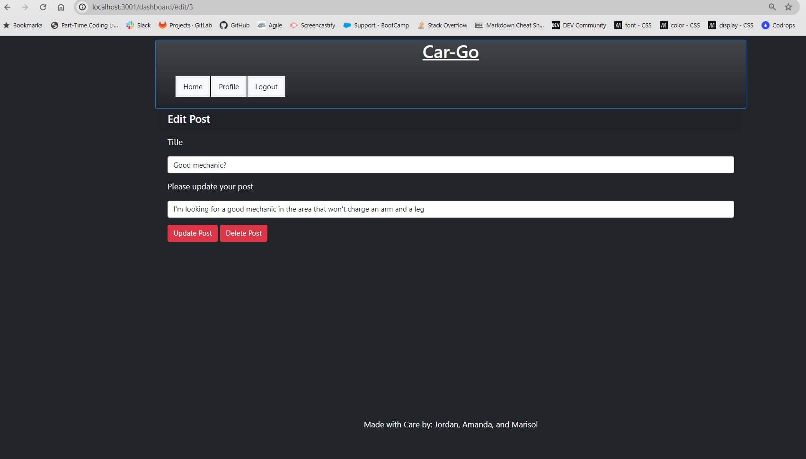
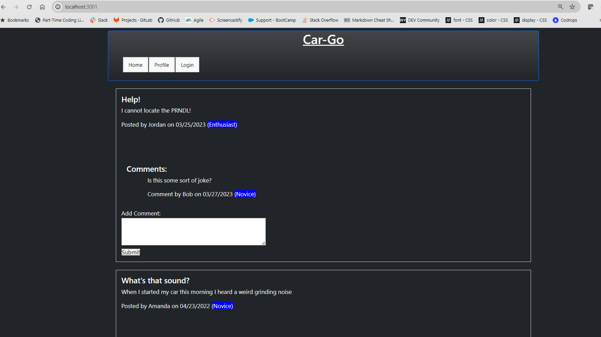
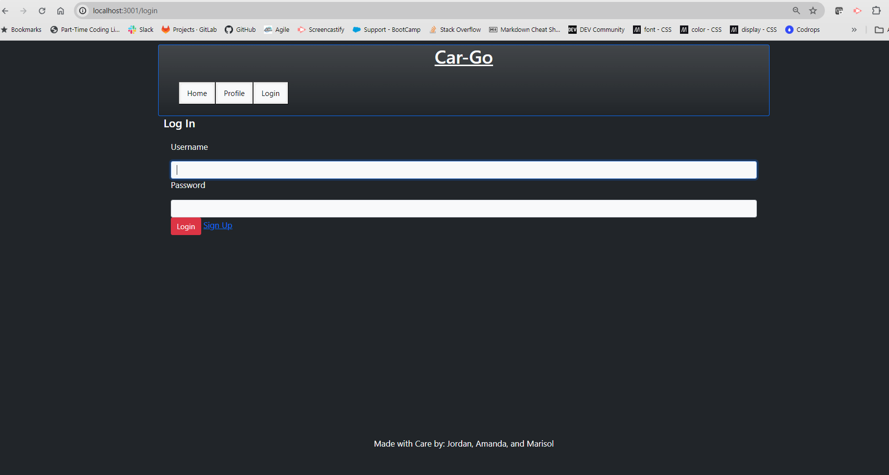
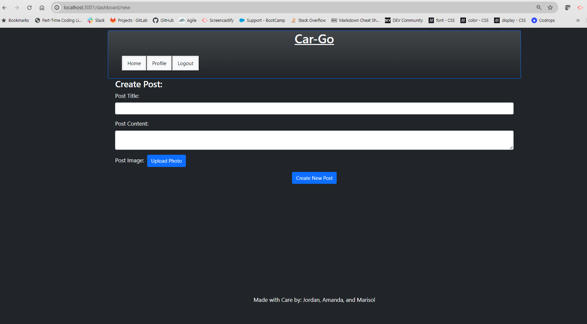
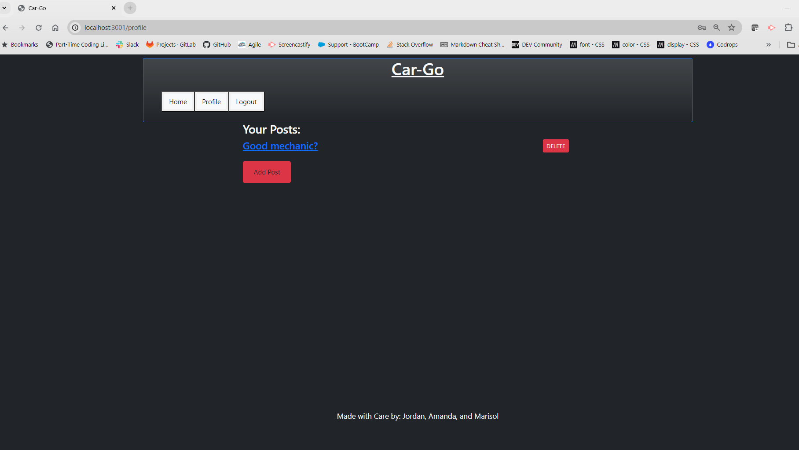
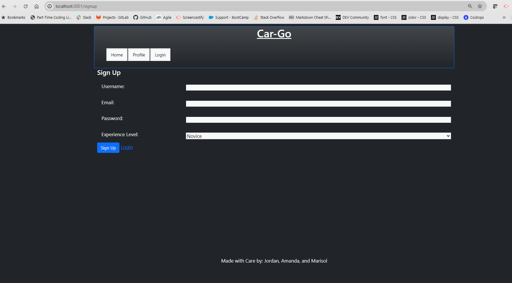
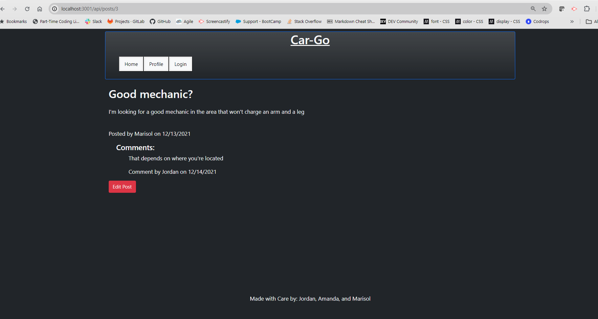

# CAR-GO

## Description
A forum to seek answers for vehicle matters from professionals or enthusiast alike. This provides you the ability to take and upload pictures of the possible issues     on your vehicle .,  and receive feedback from people with experince with these same issues. 

## Table of Contents
- [Installation](#installation)
- [Usage](#usage)
- [License](#license)
- [Contributing](#contributing)
- [Tests](#tests)
- [Questions](#questions)

## Installation
Clone the repository from git hub followign the link below. In addtiona you will need to right click on server.js open the integrated teminal and type in npm i to install express. Ensure that you have a working copy of MySQl. You will need to ensure that you have a .env file to protect your cedentials. Once you create the .env file you will beed to eter the your cedentials for MySQL and the database name foud in the db/schema.sql. In the integrates termimnal you will need to sign in to MySQL; mysql -u "your username" -p press enter and enter your password for MySQL.  You will then need to source the schema by typying  source db/schema.sql; and enter. Once that is run then type "exit ".  You will then need to seed your dtabase by entering node seeds/seeds.js and enter. Once completed you will need to start the server .

## Usage
Once everything is installed properly you will then need to start the server. To start the sever in your integrated terminal type in npm start. Then open the browser and type in localhost:3001. To sign in for testing purposes please use any user name within the seed file and the corresponding password. The seed file is located at seeds/userData. You can also sign  up with the sign up button located at the login  screen. Once logged in on your profile page you can create a post  and on the home page you can add comments to post. Within your profile you can update and delete your posts.

## Screenshots: 

      

## License

This project is covered under the MIT license.

## Contributing
Please form the repository and add your code and submit your code for approval.

## Tests
For test instructions please use insomia. Once the server has been started to interact with local host please open isomnia and do GET, POST, PUT and DELETE tests. Please follow the route guidelines within the fiels to ensure that you  attain the desired results. 

## Questions
For questions about this project, please visit my [GitHub profile](https://github.com/Marisol514) or email me at Marisol514@gmail.com.

## Features

Account/profile creation
Post and commenting features
Uploading photos

## Acknowdgements: 

Amanda Vilwock. Jordan Brown, Logan Garland & Marisol Aranda. 

## Resources: 

Bootstrap: https://getbootstrap.com/docs/5.3/getting-started/introduction/

Cloudinary: https://codesandbox.io/s/upload-widget-74ggb?file=/index.html

Heroku: https://devcenter.heroku.com/categories/reference

AskBCSLearningAssistant

Handlebars: https://handlebarsjs.com/guide/

MySQL: https://dev.mysql.com/doc/

sequilize: https://sequelize.org/docs/v6/getting-started/

node.js Express: https://developer.mozilla.org/en-US/docs/Learn/Server-side/Express_Nodejs/Introduction
                 https://stackoverflow.com/questions/11076421/express-documentation

bcrypt https://www.npmjs.com/package/bcrypt

## Future Implementations:

Addign immages to the background that changes with the change of each page / refresh. The ability to select the type vehicle as we have the data in the seeds/models. We would like to add an update and comment fuction. Woudl like to have the ability to the original post user to select the best solution for that specific problem. Update the site with a more formal introduction. We will also like to have a profile introcduction on their experience or expertise. In the posts we would like to move the most recent post to show up on top as well as to limit the number of posts on the main screen, perhaps inplement a search function. The comment section we would like to have the most recent comment to show up last.
